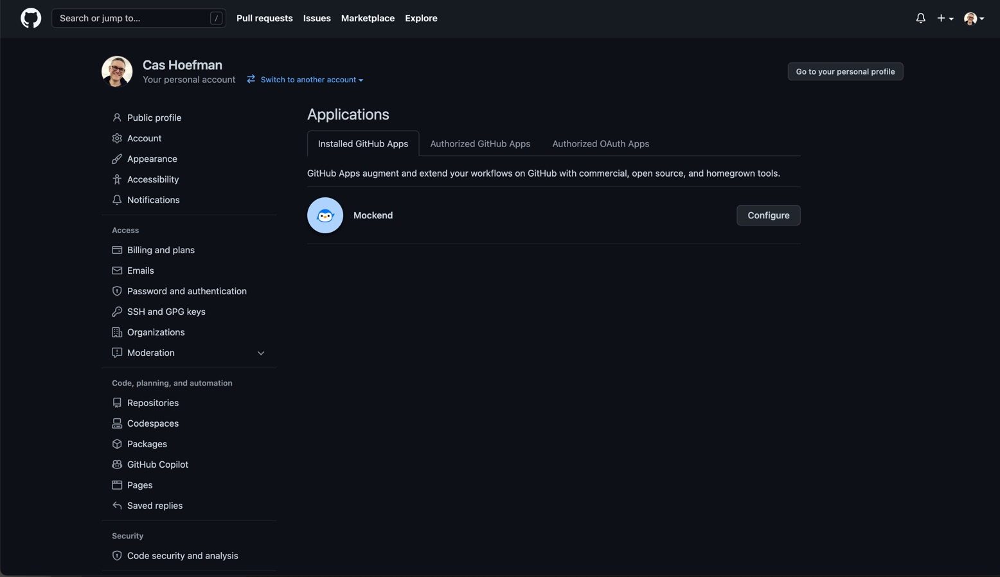
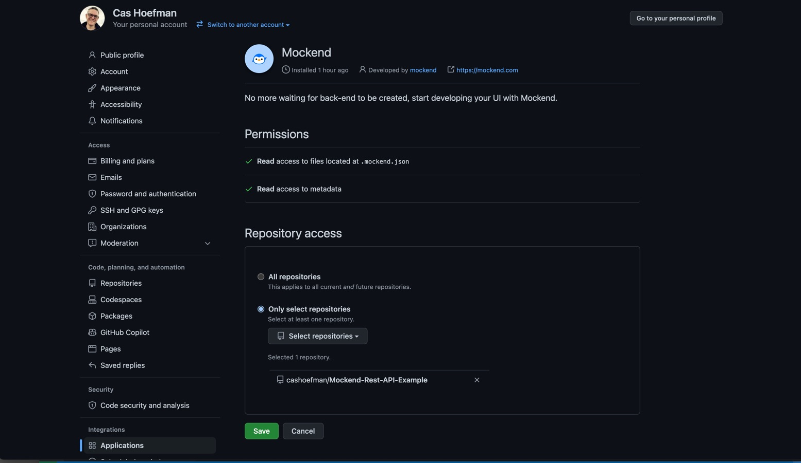
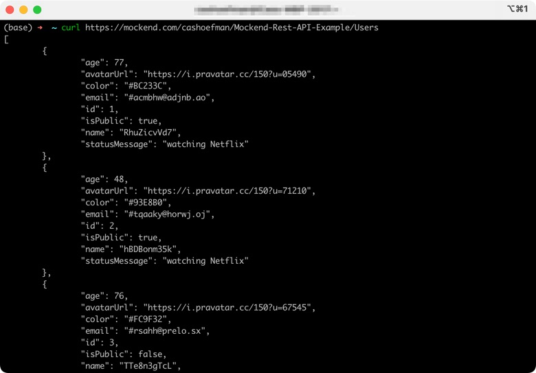

# Mockend-Rest-API-Example

### This is an example of how to use Mockend to quickly setup a REST API

Today I was goofing around with some development tools and I needed a simple REST API to do a little bit of testing. I really enjoy working with tools that make my life easier and I've written about Tools like this before.

This time around we are going to look at how to use Mockend to quickly setup a REST API. Note this is a paid service but there is a free version for personal use.

To get started, go to https://github.com/marketplace/mockend and click on "Setup a plan"!

Select the free plan and click on Install it for free! If you are already signed into your Github Account it will automatically use that or it will ask you to login to GitHub.

Next you click on "Complete order and begin installation" and than two last steps "Install & Authorize" and enter your TFA code and you are in business.

Now in your project repo create a .mockend.json file with the following basic config on your repo:

    github.com/YourName/YourRepoName/.mockend.json 

In my example that would be something like:

    github.com/cashoefman/Mockend-Rest-API-Example/.mockend.json 

    {
      "User": {
        "title": { "string": {} }
      }
    }

## Try your new mock server:

### 1. List your fake users with a GET request
    curl https://mockend.com/YourName/YourRepoName/users

In my example that is:

    curl https://mockend.com/cashoefman/Mockend-Rest-API-Example/Users

### 2. Fake a creation with a POST
##### (don't worry changes aren't persisted)
    curl https://mockend.com/<YourName>/<YourRepoName>/users \
      -X POST \
      -H "Content-Type: application/json" \
      --data '{"name": "alice"}'

### 3. Access your GraphQL endpoint
    https://mockend.com/YourName/YourRepoName/graphql

Test other random generators with this config:

    github.com/YourName/YourRepoName/.mockend.json

    {
      "User": {
        "name": {
          "string": {}
        },
        "avatarUrl": {
          "regexp": "https://i\\.pravatar\\.cc/150\\?u=[0-9]{5}"
        },
        "statusMessage": {
          "string": [
            "working from home",
            "watching Netflix"
          ]
        },
        "email": {
          "regexp": "#[a-z]{5,10}@[a-z]{5}\\.[a-z]{2,3}"
        },
        "color": {
          "regexp": "#[0-9A-F]{6}"
        },
        "age": {
          "int": {
            "min": 21,
            "max": 100
          }
        },
        "isPublic": {
          "boolean": {}
        }
      }
    }

Or, See their documentation for more details at https://mockend.com/post-install

And that seemed so easy but, when I tested it, it didn't work. I got some error that I needed to switch to the paid plan or select 1 repo. Nowhere did I find any information on how to "select that 1 repo". But this is what I found.

1. Go back to https://github.com/marketplace/mockend
2. Click on "Configure access".

3. Click the "Configure" button.

4. On the next page click the radio button next to "Only Selected Repos" and, 
5. Select the Repo that you pushed the .mockend.json file to.

And now you ARE in business!

Have fun!